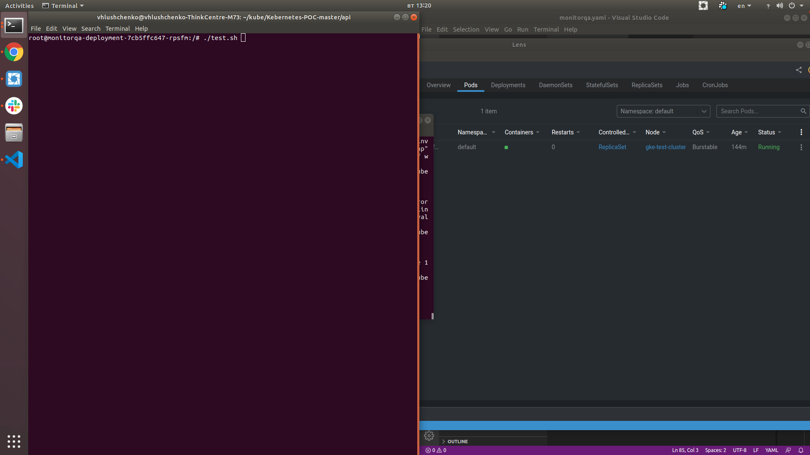
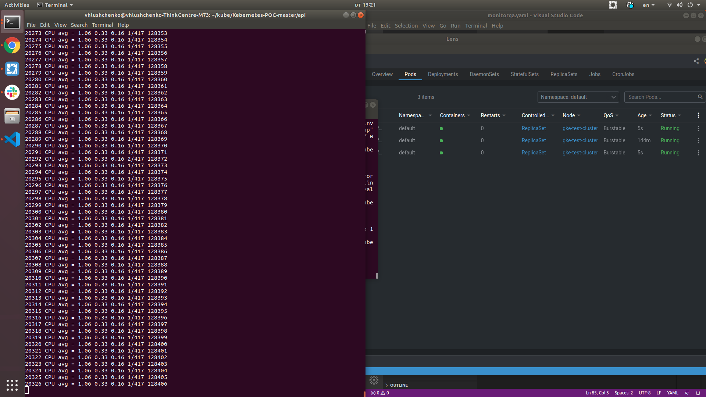
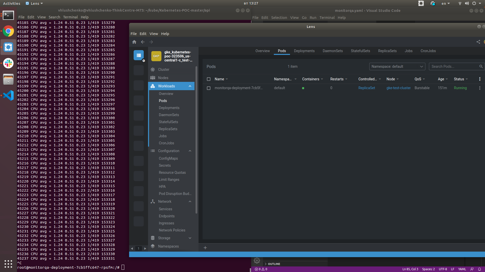

1. Create secret comfigs
```shell
kubectl create secret generic secret-appsettings --from-file=./appsettings.secrets.json
kubectl create secret generic secret-firebase --from-file=./firebase.secrets.json
```
2. Certificate details
   Generate Certificate key and fullchain with serice sslforfree.com
   Create SSL certificate sercret
```shell
kubectl create secret tls my-certificate-secret --cert fullchain.crt --key private.key
```

3. Install API
```shell
kubectl apply -f monitorqa.yaml
kubectl apply -f ingress.yaml
```

Testing HPA:

1. Check pods.
```shell
kubectl get pods
```

2. Copy script to container.
```shell
kubectl cp /path/to/Kebernetes-POC-master/test.sh <pod-name>:/
```

3. Enter in the pod and starting script.
```shell
kubectl exec -it <pod-name> /bin/bash
cd ..
chmod +x test.sh
./test.sh
```

4. Wait for launch additional pods.


Example testing:






